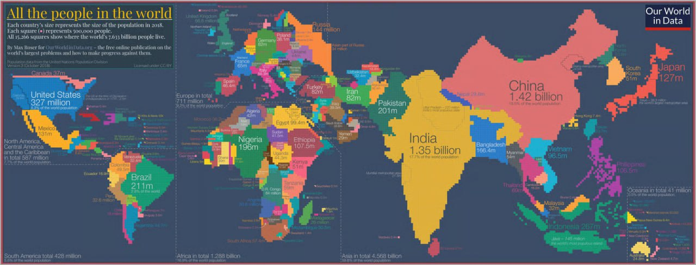

## 1. Background

### 1.1 Chosen Visualization 

[(Link)](https://ourworldindata.org/population-growth)

**Context:**
The chosen visualization is a **World Population Cartogram** created by *Our World in Data*. In this visualization, each small square represents 500,000 people (based on 2018 data). Unlike standard geographic maps which scale based on land mass, this map distorts the geometry of countries relative to their total population size.

### 1.2 The Story to Tell
The original visualization tells a static story of **concentration**: it highlights that the majority of humans live in Asia, with China and India dominating the visual landscape.

However, the story we aim to tell is one of **evolution and composition**. Population is not just a total number; it is dynamic. We want to shift the narrative from *"Where are people living in 2018?"* to *"How has the global population center shifted over time, and what are the demographic drivers (gender) behind this growth?"* By adding the dimension of time and gender composition, we aim to tell the story of the rise of the Global South and the demographic distinctiveness of different regions.

### 1.3 Strengths and Weaknesses
**Strengths**

One major strength of this visualization is that it effectively represents **perceptual scaling** by resizing countries based on population instead of land area. This allows highly populated countries such as China and India to stand out clearly, helping viewers quickly understand where most of the world’s population is concentrated. Another strength is the use of a clear **quantitative encoding** where each square represents 500,000 people. This consistent unit allows the viewer to interpret the sizes of countries more meaningfully and understand how population differences are visually calculated. Additionally, the visualization presents a high level of **information density** by including population figures for individual countries while also providing regional totals, allowing users to compare population sizes at both the country and continental levels within a single graphic.

**Weaknesses**

Despite its effectiveness, the visualization also has several limitations. One issue is **visual clutter**, particularly in densely populated regions such as Europe where many small countries and labels are placed very close together, making them difficult to read. Small countries are also harder to notice because they are represented by only a few squares, which can make them visually insignificant compared to larger nations. Another limitation is the **ineffective use of colour encoding**, as colour choices mainly serve to differentiate neighbouring countries rather than encode meaningful categories such as regions or population groups, which reduces the potential informational value of colour. Finally, because the visualization is static it results in **temporal stagnation**, users cannot zoom in, filter regions, or interact with the data, which limits deeper exploration and makes it harder to examine specific countries or densely packed areas.

------------------------------------------------------------------------

## 2. Proposal

### 2.1 Proposed Solution & Architecture
We propose building a **Dynamic Population Dashboard** using R. Instead of a static cartogram, we will implement a single, interactive **world choropleth map** that focuses on gender imbalance. The map will include simple controls (e.g., year slider and continent filters) and may use animation via `gganimate` or interactivity via `plotly` to show how the same map changes over time.

The system will ingest raw population data, process it to include demographic splits and derived metrics, and render it using `ggplot2` and `gganimate` (or `plotly`) to allow users to observe changes from 1950 to 2024.

### 2.2 Improvements & Justifications
We have transformed the original dataset `population.csv` into a robust dataset `clean_population_final.csv`. The specific improvements are detailed below:

| Improvement | Action Taken | Justification |
|:---|:---|:---|
| **Standardization** | Renamed `all years` to `Population`. | "All years" is ambiguous. Standardizing the variable name ensures code readability and cleaner axis labels in plotting. |
| **Demographic Enrichment** | Integrated `Male_Population` and `Female_Population`. | The original dataset lacked depth. Adding gender allows us to analyze sex ratios and detect demographic anomalies (e.g., skewing due to migration or policy). |
| **Derived Metrics** | Calculated `Growth` (Absolute) and `Growth_Percentage`. | Raw numbers don't tell the whole story. Relative growth percentages allow for fair comparisons between small emerging nations and large developed ones. |
| **Categorization** | Added `Continent` column. | The original data listed entities flatly. Grouping by continent enables high-level aggregation and color-coding to reduce visual noise. |

### 2.3 Proposed Visualization Improvements & Justifications
To address the weaknesses of the original static cartogram (visual clutter, weak colour encoding, and lack of temporal context), we will implement **one primary improved visualization** on top of the engineered dataset:


- **Design**  
  A world choropleth where each country is shaded based on its gender imbalance (e.g., male–female difference as a proportion of total population). We will use a **diverging colour scale centered at “balanced”**: countries with more females will be shown in shades of **pink**, countries with more males in shades of **blue**, and **white** will represent a near-balanced population. Darker shades indicate larger imbalances, while lighter shades indicate smaller deviations from balance. A **year slider** will allow users to move from 1950 to 2023 using the same map layout, and simple filters (e.g., by continent) will reduce clutter when focusing on specific regions.

- **Improvement over original**  
  Instead of colours merely separating neighbouring countries, colour now directly encodes a **meaningful demographic variable (gender imbalance)**. The choropleth reduces **visual clutter** by using familiar country polygons instead of small squares and lets viewers zoom/filter to specific regions. The year slider (and optional animation) addresses **temporal stagnation** by allowing users to see how gender imbalance changes over time on the same map.

- **Justification**  
  This visualization links directly to our enriched dataset with `Male_Population` and `Female_Population`, as well as our derived gender-imbalance index. By focusing our design and interactivity on a single, interpretable map, we highlight both the **geography** and the **evolution** of gender imbalance, while staying within the “one main chart” constraint of the project brief.


### 2.4 Data Sources
* **Original Source:** *World Population Cartogram by Our World in Data* [(Link)](https://ourworldindata.org/population-growth).
* **Input File:** `population.csv` (Raw counts per country/year). This file is downloaded from the same Our World in Data page, which links to the underlying **United Nations World Population Prospects** data explorer. In that interface, we can select different **indicators** (e.g., total population, growth rate), **sex** (both sexes, female, male), and **age groups** before exporting the data.
* **Processed File:** `cleaned_population_final.csv` (Enriched with gender splits, growth metrics, and continental grouping).
  
The primary data source for this project is Our World in Data, which provides reliable and publicly accessible datasets on global demographic statistics. The population growth data used in the visualization includes historical records of total population by country over multiple years. These datasets are compiled from internationally recognized sources such as the United Nations, particularly the UN World Population Prospects database. This ensures that the population figures are standardized, consistently updated, and comparable across countries. The dataset includes yearly population estimates for countries such as China, India, and United States, allowing analysis of long-term population trends.

In addition to total population growth, the project will integrate gender-specific population data from the same platform. Our World in Data provides datasets that break down population statistics by gender, including the number of males and females in each country over time. These datasets are also largely derived from the United Nations demographic databases, which collect and estimate population statistics reported by national statistical agencies worldwide. By combining overall population growth data with gender-disaggregated population data, the project can analyse how male and female populations change at different rates across countries and over time. This integration allows deeper insights into demographic patterns such as gender imbalance, aging populations, and variations in population growth across regions.


### 2.5 Detailed Workflow from raw to visualization-ready data

Our data engineering workflow transforms the original raw CSVs into a single, tidy, visualization-ready table:

1. **Ingest raw population files**
   - We download country-level population data from the Our World in Data / UN World Population Prospects explorer, exporting:
     - `population.csv` for **total population** (both sexes combined).
     - `male-population.csv` for **male-only population** using the same countries, years, and indicator settings.
   - In R, we load both files using `readr::read_csv()` and store them as `population` and `male`.

2. **Join total and male population**
   - We perform a **left join** on `Entity`, `Code`, and `Year` so that each row contains both total and male population for the same country–year combination.
   - After joining, we **standardize column names**, renaming the ambiguous `all years` variables to:
     - `Population` (total population),
     - `Male_Population` (male population).

3. **Handle missing values and invalid rows**
   - We check for missing values by computing column-wise `NA` counts before and after cleaning.
   - Rows with missing country codes (`Code`) are removed, since they usually correspond to aggregates or entities that are not needed for country-level analysis.
   - We confirm that no duplicated `(Entity, Code, Year)` combinations remain.

4. **Derive female population and validate gender splits**
   - We compute `Female_Population` as `Population - Male_Population`.
   - As a quality check, we flag any rows where `Population` differs from `Male_Population + Female_Population` by more than a small tolerance, and verify that there are no negative values in any of the three population columns.

5. **Ensure correct year type and coverage**
   - We convert `Year` to integer to support time-series analysis.
   - For each country, we summarise the **minimum year**, **maximum year**, and **number of observations** to check that coverage is consistent (e.g., 1950–2023) and identify any gaps or anomalies.

6. **Create growth metrics**
   - Within each country, we sort the data by year and compute:
     - `Growth` = change in total population compared with the previous year.
     - `Growth_Percentage` = year-on-year percentage growth.
   - These derived metrics allow us to compare growth patterns across countries with very different base population sizes.

7. **Add continent information**
   - Using the `countrycode` package, we map each `Entity` to a `Continent` (e.g., Asia, Europe, Africa).
   - We inspect any entities that do not automatically match a continent and ensure that, for our analysis, all relevant countries are successfully assigned.

8. **Export visualization-ready dataset**
   - Finally, we save the cleaned and enriched table as `cleaned_population_final.csv`.
   - This file contains, for each country–year: `Entity`, `Code`, `Year`, `Population`, `Male_Population`, `Female_Population`, `Growth`, `Growth_Percentage`, and `Continent`. It serves as the single, reproducible input for our improved choropleth map.

### 2.6 Data Analysis

In addition to producing visualizations, we plan to conduct basic data analysis on the cleaned dataset to support our story:

- **Trend of global gender imbalance over time**  
  We will compute a yearly **global average gender-imbalance index** (e.g., $(\text{Male\_Population} - \text{Female\_Population}) / \text{Population}$) and examine how it changes from 1950–2023. This helps us see whether the world is moving towards a more balanced gender structure or not.

- **Regional comparisons by continent**  
  Using the `Continent` variable, we will compare average gender imbalance across continents and over time, highlighting which regions tend to be more male- or female-dominant. This supports our narrative about the demographic distinctiveness of different regions.

- **Relationship between population growth and gender imbalance**  
  With `Growth_Percentage`, we will explore whether countries with **high population growth** also tend to have stronger gender imbalances. This will be done using simple summaries (correlations and grouped comparisons) and visual aids such as scatter plots.

- **Identification of outlier countries**  
  Finally, we will identify countries with **unusually high or low** gender imbalance compared to others in the same region, and discuss possible explanations (e.g., migration, policy, or social factors). These outliers will be highlighted on the choropleth map to connect the analysis back to the visualization.

### 2.7 Work Distribution

```{r}
#| echo: false
#| message: false
library(knitr)

work_dist_final <- data.frame(
  Task = c("Project Background", "Original Analysis", "Design Proposal", 
           "Data Engineering — Cleaning", "Data Engineering — Transformation", 
           "Improved Visualisation", "Technical Integration", "Conclusion"),
  Allocation = c("Lance", "Joash", "Everyone", "Everyone", "Izwan", "Tanvi", "Wei Hao", "Everyone"), 
  Responsibility = c(
    "Describe project topic, objectives, and original context.",
    "Combined analysis of original design and effectiveness.",
    "Propose dynamic solution and justify improvements.",
    "R code for data ingestion and standardization.",
    "Derive gender splits, growth metrics, and continents.",
    "Create the improved visualization and interpret results.",
    "Assemble Quarto file and check reproducibility.",
    "Summarize findings and final project impact."
  )
)

kable(work_dist_final)
```