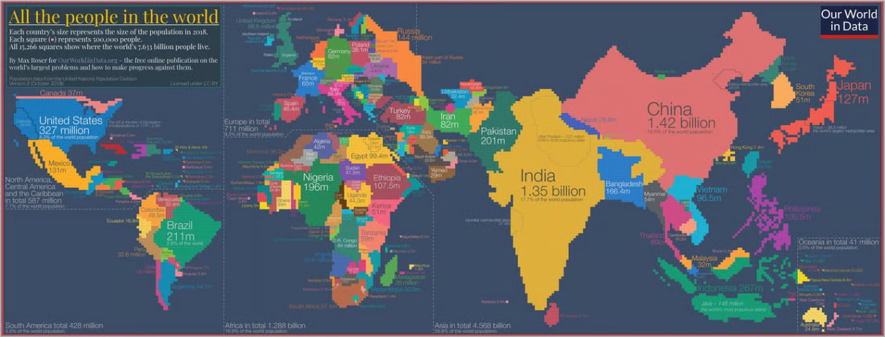

```{r}
#| label: setup
#| include: false
library(knitr)
```

## Agenda {.unnumbered #agenda}

<hr>

- [Orignal Data Visualization - Joash](#original-viz)
- [Critiques and Proposed Improvements - Joash](#critiques)
- [Data Selection and Sources - Izwan](#data-selection)
- [Data Engineering Workflow (from raw data to visualization-ready data) - Lancea](#workflow)
- [Improved Visualization (corresponding to proposed improvements) - Wei Hao](#improved-viz)
- [Demo for Improved Visualization - Wei Hao](#demo-viz)
- [Insights and Analysis - Tanvi](#insights)
- [Conclusion - Tanvi](#conclusion)

## Orignal Data Visualization - Joash{#original-viz}
{width="100%" fig-align="center"}

::: {style="font-size: 0.75em; margin-top: 8px;"}
::: columns
::: {.column width="50%"}
- 🗺️ **Visual clutter** — Densely packed regions (e.g. Europe) are unreadable, small nations are reduced to a few insignificant pixels
- 📦 **Static snapshot** — Frozen in 2018, offers 0 temporal context
- 🎨 **Wasted visual channel** — Color is used only to distinguish borders
:::
::: {.column width="50%"}
- 🕐 **No interactivity** — No ability to zoom, filter, or obtain precise data
- ⚧ **Lack of dimensionality** — Treats population as a single, generic aggregate
:::
:::
:::

## Proposed Improvements - Joash{#critiques}
<hr>

::: {style="line-height: 2.4;"}
- 🌍 **Interactive choropleth map** — Uses familiar geography boundaries, and reduces clutter
- 🌐 **Data on demand UI** — Continent filters and hover tooltips to reduce visual overload
- 📅 **Year slider (1950–2023)** — Integrated slider that reveals evolution of population over time
- ⚧ **Gender Imbalance Index** — Custom metric that quantifies male/female deviation per country
- 🎨 **Diverging colour scale** — Pink = more female, Blue = more male, making gender imbalance immediately visible
:::

## Data Selection and Sources - Izwan{#data-selection}

<hr>

:::: {.callout-note}
Summarize the dataset used, where it came from, and any key caveats (coverage, time range, missingness, definitions).
::::

## Data Engineering Workflow (from raw data to visualization-ready data) - Lancea{#workflow}

<hr>

::::: columns
::::: {.column width="42%"}
::: {.callout-note}
**Inputs**

::: {.nonincremental}
- `data/population.csv` (total)
- `data/male-population.csv` (male)
:::

**Output (used in viz)**

::: {.nonincremental}
- `data/cleaned_population_with_growth.csv`
:::

**Viz-only derivations**

::: {.nonincremental}
- `Continent` (via `countrycode`)
- **Imbalance Index** \(=\frac{Male - Female}{Total}\times 100\)
:::
:::
:::::

::::: {.column width="58%"}
::: {.callout-note}
**Pipeline (raw → visualization-ready)**

1) **Align keys**: `Entity`, `Code` (ISO-3), `Year`  
2) **Join** total + male on the keys  
3) **Derive female**: `Female_Population = Population - Male_Population`  
4) **Filter** unmappable/non-country rows (missing ISO-3 `Code`)  
5) **Growth (per country, sorted by year)**:

::: {.nonincremental}
   - `Growth_Absolute = Population - lag(Population)`
   - `Growth_Pct = (Growth_Absolute / lag(Population)) * 100`
:::
:::
:::::
:::::


## Appendix: R Code — Data Engineering - Lancea{.unnumbered}

<hr>

::::: columns
::::: {.column width="52%"}
### Pipeline

```r
library(readr); library(dplyr); library(countrycode)

population <- read_csv("data/population.csv",
                       show_col_types = FALSE)
male       <- read_csv("data/male-population.csv",
                       show_col_types = FALSE)

cleaned_population <- population %>%
  left_join(male, by = c("Entity", "Code", "Year"),
            suffix = c("_Total", "_Male")) %>%
  rename(Population      = `all years_Total`,
         Male_Population = `all years_Male`) %>%
  filter(!is.na(Code)) %>%          # drop aggregates
  mutate(
    Female_Population = Population - Male_Population,
    Year = as.integer(Year)
  ) %>%
  arrange(Entity, Year) %>%
  group_by(Entity) %>%
  mutate(
    Growth            = Population - lag(Population),
    Growth_Percentage = Growth / lag(Population) * 100
  ) %>%
  ungroup() %>%
  mutate(Continent = countrycode(Entity,
                                 "country.name",
                                 "continent"))
```
:::::

::::: {.column width="48%"}
### Validation checks

```r
# Duplicate country–year keys → 0
repeated <- cleaned_population %>%
  count(Entity, Code, Year) %>%
  filter(n > 1)

# Total ≠ Male + Female → 0
gender_mismatch <- cleaned_population %>%
  filter(
    abs(Population -
        (Male_Population + Female_Population)) > 1
  )

# Any negative values → 0
negative <- cleaned_population %>%
  filter(Population    < 0 |
         Male_Population < 0 |
         Female_Population < 0)

list(
  count_repeated        = nrow(repeated),        # 0
  count_gender_mismatch = nrow(gender_mismatch),  # 0
  count_negative        = nrow(negative)          # 0
)
```
:::::
:::::

---

## Improved Visualization (corresponding to proposed improvements) - Wei Hao{#improved-viz}

:::: columns
:::: {.column width="30%"}
::: {style="font-size: 0.78em;"}
**What we changed**

- 🎨 **Diverging color scale** — pink = more female, blue = more male, white = balanced
- 📅 **Year slider** — explore 1950 to 2023
- 🌍 **Continent filter** — isolate any region
- 🖱️ **Hover tooltips** — full country details on demand
- 📊 **Gender imbalance index** — quantified per country
:::
::::

:::: {.column width="70%"}
```{r}
#| echo: false
#| warning: false
#| message: false
#| #| fig.width: 11
#| fig.height: 6
#| out.width: "100%"
library(plotly)
library(dplyr)
library(readr)
library(scales)
library(countrycode)

cleaned_population_with_growth <- read_csv("data/cleaned_population_with_growth.csv", show_col_types = FALSE)

cleaned_population_final <- cleaned_population_with_growth %>%
  mutate(
    Continent = countrycode(sourcevar = Entity,
                            origin = "country.name",
                            destination = "continent"),
    Continent = recode(Continent, "Americas" = "America")
  )

map_data <- cleaned_population_final %>%
  filter(!is.na(Code), !is.na(Continent)) %>%
  mutate(
    Imbalance_Index = (Male_Population - Female_Population) / Population * 100,
    Male_Pct = Male_Population / Population * 100,
    Female_Pct = Female_Population / Population * 100
  )

continents <- sort(unique(map_data$Continent))
all_years <- sort(unique(map_data$Year))
yr_data_init <- map_data %>% filter(Year == max(all_years))

continent_buttons <- lapply(c("All", continents), function(cont) {
  if (cont == "All") {
    z_vals <- yr_data_init$Imbalance_Index
  } else {
    z_vals <- ifelse(yr_data_init$Continent == cont,
                     yr_data_init$Imbalance_Index, NA)
  }
  list(
    method = "restyle",
    label = cont,
    args = list(list(
      z = list(z_vals),
      locations = list(yr_data_init$Code)
    ))
  )
})

frames <- lapply(all_years, function(yr) {
  yr_data <- map_data %>% filter(Year == yr)
  list(
    data = list(list(
      type = "choropleth",
      locations = yr_data$Code,
      z = yr_data$Imbalance_Index,
      text = paste0(
        "<b>", yr_data$Entity, "</b><br>",
        "Continent: ", yr_data$Continent, "<br>",
        "Year: ", yr, "<br>",
        "Total Population: ", scales::comma(yr_data$Population), "<br>",
        "Male: ", scales::comma(yr_data$Male_Population), " (", round(yr_data$Male_Pct, 1), "%)<br>",
        "Female: ", scales::comma(yr_data$Female_Population), " (", round(yr_data$Female_Pct, 1), "%)<br>",
        "Imbalance Index: ", round(yr_data$Imbalance_Index, 2)
      )
    )),
    name = as.character(yr),
    traces = list(0)
  )
})

slider_steps <- lapply(all_years, function(yr) {
  list(
    args = list(
      list(as.character(yr)),
      list(
        mode = "immediate",
        frame = list(duration = 300, redraw = TRUE),
        transition = list(duration = 100)
      )
    ),
    label = as.character(yr),
    method = "animate"
  )
})

fig <- plot_ly(
  data = yr_data_init,
  type = "choropleth",
  locations = ~Code,
  locationmode = "ISO-3",
  z = ~Imbalance_Index,
  text = ~paste0(
    "<b>", Entity, "</b><br>",
    "Continent: ", Continent, "<br>",
    "Year: ", Year, "<br>",
    "Total Population: ", scales::comma(Population), "<br>",
    "Male: ", scales::comma(Male_Population), " (", round(Male_Pct, 1), "%)<br>",
    "Female: ", scales::comma(Female_Population), " (", round(Female_Pct, 1), "%)<br>",
    "Imbalance Index: ", round(Imbalance_Index, 2)
  ),
  hoverinfo = "text",
  colorscale = list(
    list(0.0, "#C2185B"),
    list(0.5, "#FFFFFF"),
    list(1.0, "#1565C0")
  ),
  zmin = -15,
  zmax = 15,
  colorbar = list(
    title = "Gender Imbalance<br>(% Male excess)",
    tickvals = c(-15, -10, -5, 0, 5, 10, 15),
    ticktext = c("-15% (F)", "-10%", "-5%", "0 (Balanced)", "+5%", "+10%", "+15% (M)"),
    x = 1.0,
    y = 1.0,
    yanchor = "top",
    len = 0.5
  )
) %>%
  layout(
    title = list(
      text = "Global Gender Imbalance Over Time (1950–2023)",
      font = list(size = 16)
    ),
    geo = list(
      showframe = FALSE,
      showcoastlines = TRUE,
      projection = list(type = "natural earth"),
      domain = list(x = c(0, 0.78), y = c(0.1, 1.0))
    ),
    updatemenus = list(
      list(
        type = "buttons",
        direction = "down",
        x = 0.82,
        y = 0.85,
        xanchor = "left",
        yanchor = "top",
        pad = list(t = 5, r = 5),
        bgcolor = "#ffffff",
        bordercolor = "#cccccc",
        borderwidth = 1,
        font = list(size = 10),
        buttons = continent_buttons
      )
    ),
    sliders = list(
      list(
        active = length(all_years) - 1,
        steps = slider_steps,
        x = 0.0,
        y = 0.05,
        len = 0.78,
        currentvalue = list(
          prefix = "Year: ",
          visible = TRUE,
          xanchor = "center",
          font = list(size = 11)
        ),
        transition = list(duration = 100),
        pad = list(t = 20)
      )
    ),
    annotations = list(
      list(
        text = "<b>Filter by<br>Continent</b>",
        x = 0.82,
        y = 0.93,
        xref = "paper",
        yref = "paper",
        showarrow = FALSE,
        font = list(size = 10),
        xanchor = "left"
      )
    ),
    coloraxis = list(
      colorbar = list(
        x = 1.0,
        y = 0.5,
        len = 0.5
      )
    ),
    margin = list(l = 5, r = 150, t = 40, b = 60)
  )
fig$x$frames <- frames
fig
```
::::
::::

---

## Demo for Improved Visualization - Wei Hao{#demo-viz}
```{r}
#| echo: false
#| warning: false
#| message: false
#| #| #| fig.width: 11
#| fig.height: 6
#| out.width: "100%"
library(plotly)
library(dplyr)
library(readr)
library(scales)
library(countrycode)

cleaned_population_with_growth <- read_csv("data/cleaned_population_with_growth.csv", show_col_types = FALSE)

cleaned_population_final <- cleaned_population_with_growth %>%
  mutate(
    Continent = countrycode(sourcevar = Entity,
                            origin = "country.name",
                            destination = "continent"),
    Continent = recode(Continent, "Americas" = "America")
  )

map_data <- cleaned_population_final %>%
  filter(!is.na(Code), !is.na(Continent)) %>%
  mutate(
    Imbalance_Index = (Male_Population - Female_Population) / Population * 100,
    Male_Pct = Male_Population / Population * 100,
    Female_Pct = Female_Population / Population * 100
  )

continents <- sort(unique(map_data$Continent))
all_years <- sort(unique(map_data$Year))
yr_data_init <- map_data %>% filter(Year == max(all_years))

continent_buttons <- lapply(c("All", continents), function(cont) {
  if (cont == "All") {
    z_vals <- yr_data_init$Imbalance_Index
  } else {
    z_vals <- ifelse(yr_data_init$Continent == cont,
                     yr_data_init$Imbalance_Index, NA)
  }
  list(
    method = "restyle",
    label = cont,
    args = list(list(
      z = list(z_vals),
      locations = list(yr_data_init$Code)
    ))
  )
})

frames <- lapply(all_years, function(yr) {
  yr_data <- map_data %>% filter(Year == yr)
  list(
    data = list(list(
      type = "choropleth",
      locations = yr_data$Code,
      z = yr_data$Imbalance_Index,
      text = paste0(
        "<b>", yr_data$Entity, "</b><br>",
        "Continent: ", yr_data$Continent, "<br>",
        "Year: ", yr, "<br>",
        "Total Population: ", scales::comma(yr_data$Population), "<br>",
        "Male: ", scales::comma(yr_data$Male_Population), " (", round(yr_data$Male_Pct, 1), "%)<br>",
        "Female: ", scales::comma(yr_data$Female_Population), " (", round(yr_data$Female_Pct, 1), "%)<br>",
        "Imbalance Index: ", round(yr_data$Imbalance_Index, 2)
      )
    )),
    name = as.character(yr),
    traces = list(0)
  )
})

slider_steps <- lapply(all_years, function(yr) {
  list(
    args = list(
      list(as.character(yr)),
      list(
        mode = "immediate",
        frame = list(duration = 300, redraw = TRUE),
        transition = list(duration = 100)
      )
    ),
    label = as.character(yr),
    method = "animate"
  )
})

fig_demo <- plot_ly(
  data = yr_data_init,
  type = "choropleth",
  locations = ~Code,
  locationmode = "ISO-3",
  z = ~Imbalance_Index,
  text = ~paste0(
    "<b>", Entity, "</b><br>",
    "Continent: ", Continent, "<br>",
    "Year: ", Year, "<br>",
    "Total Population: ", scales::comma(Population), "<br>",
    "Male: ", scales::comma(Male_Population), " (", round(Male_Pct, 1), "%)<br>",
    "Female: ", scales::comma(Female_Population), " (", round(Female_Pct, 1), "%)<br>",
    "Imbalance Index: ", round(Imbalance_Index, 2)
  ),
  hoverinfo = "text",
  colorscale = list(
    list(0.0, "#C2185B"),
    list(0.5, "#FFFFFF"),
    list(1.0, "#1565C0")
  ),
  zmin = -15,
  zmax = 15,
  colorbar = list(
    title = "Gender Imbalance<br>(% Male excess)",
    tickvals = c(-15, -10, -5, 0, 5, 10, 15),
    ticktext = c("-15% (F)", "-10%", "-5%", "0 (Balanced)", "+5%", "+10%", "+15% (M)"),
    x = 1.0,
    y = 1.0,
    yanchor = "top",
    len = 0.6
  )
) %>%
  layout(
    title = list(
      text = "Global Gender Imbalance Over Time (1950–2023)",
      font = list(size = 16)
    ),
    geo = list(
      showframe = FALSE,
      showcoastlines = TRUE,
      projection = list(type = "natural earth"),
      domain = list(x = c(0, 0.78), y = c(0.1, 1.0))
    ),
   updatemenus = list(
      list(
        type = "buttons",
        direction = "down",
        x = 0.82,
        y = 0.85,
        xanchor = "left",
        yanchor = "top",
        pad = list(t = 5, r = 5),
        bgcolor = "#ffffff",
        bordercolor = "#cccccc",
        borderwidth = 1,
        font = list(size = 10),
        buttons = continent_buttons
      )
    ),
    sliders = list(
      list(
        active = length(all_years) - 1,
        steps = slider_steps,
        x = 0.0,
        y = 0.05,
        len = 0.78,
        currentvalue = list(
          prefix = "Year: ",
          visible = TRUE,
          xanchor = "center",
          font = list(size = 11)
        ),
        transition = list(duration = 100),
        pad = list(t = 20)
      )
    ),
    annotations = list(
      list(
        text = "<b>Filter by<br>Continent</b>",
        x = 0.82,
        y = 0.93,
        xref = "paper",
        yref = "paper",
        showarrow = FALSE,
        font = list(size = 10),
        xanchor = "left"
      )
    ),
    coloraxis = list(
      colorbar = list(
        x = 1.0,
        y = 0.5,
        len = 0.5
      )
    ),
    margin = list(l = 5, r = 150, t = 40, b = 60)
  )
fig_demo$x$frames <- frames
fig_demo
```


## Insights and Analysis  -  Tanvi{#insights}

<hr>

::::: columns
::::: {.column width="38%"}
### What the map shows

- 📌 **Metric**: Gender Imbalance Index (GII) = (Male − Female) / Total × 100
- 🧮 **Interpretation**: + male-heavy, − female-heavy, 0 balanced
- 🎨 **Encoding**: diverging scale centered at 0 (white)
- 🧭 **Interaction**: year slider (1950–2023), hover tooltips, continent filter (static view)
:::::

::::: {.column width="62%"}
### Key insights

- ✅ **Near-balance is common**: most countries stay close to 0; larger deviations are concentrated in a smaller set of countries.
- ⏱️ **Time matters**: the year slider shows shifts toward/away from balance in different periods.
- 🌍 **Regional patterns are clearer**: continent filtering reduces clutter and improves within-region comparison.
- 🔎 **Easy to validate**: hover tooltips show country-year totals and shares for quick cross-checking.
:::::
:::::
---

## Conclusion - Tanvi{#conclusion}

<hr>

### Conclusion

- 🚀 **What we improved**  
  We replaced a **static 2018 cartogram** with an **interactive, time-aware choropleth** where color encodes one interpretable demographic signal (GII). This makes comparison across countries and years straightforward.

- ⭐ **Most important takeaway**  
  From 1950–2023, most countries stay close to balance, while a smaller set shows **persistent or period-specific outlier imbalances** that stand out clearly on the diverging scale.

- ⚠️ **Limitation (by design)**  
  Because this is a **country-level** view, it summarizes national patterns rather than within-country differences. It’s ideal for global comparison, and it can be extended with age-group or subnational data when available.